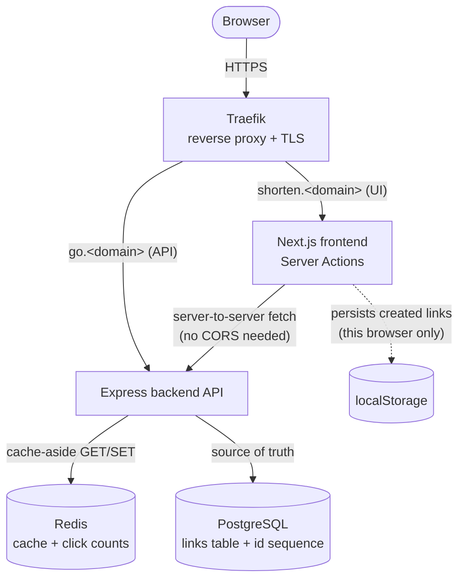

# shortly

A URL shortener with a Next.js frontend and an Express backend, using Postgres as the
source of truth and Redis as a cache-aside layer plus click counter.

## High-level design



**Request flow**

- `POST /shorten` — backend allocates an id from a Postgres sequence, base62-encodes it,
  inserts `{id, code, long_url}`, and returns `{code, short_url}`.
- `GET /r/<code>` — cache-aside read: check Redis first (`CACHE_ENABLED=true`); on a miss,
  read Postgres and repopulate Redis with a TTL. Always increments `clicks:<code>` in Redis,
  then responds with a `301`/`302` redirect (configurable via `REDIRECT_STATUS`).
- `GET /stats/<code>` — reads the click count from Redis.
- The frontend never calls the backend from the browser — `POST /shorten` and the stats
  page both run as Next.js Server Actions / Server Components, so the backend is only ever
  reached server-to-server. The list of links you've created is kept in the browser's
  `localStorage` (no "list all links" endpoint exists), so it's per-browser, not global.

## Tech stack

| Layer | Stack |
|---|---|
| Frontend | Next.js 16 (App Router, Server Actions), TypeScript, Tailwind CSS |
| Backend | Node.js, Express, `pg`, `redis` |
| Datastore | PostgreSQL (persistent), Redis (cache + click counters) |
| Infra | Docker Compose, Traefik (TLS termination + routing) in production |

## Project structure

```
backend/
  src/
    config/        env var loading + defaults
    db/            Postgres pool, Redis client
    routes/        health, shorten, redirect, stats
    utils/         base62 encoding, header-safety checks
  pg/init.sql       schema + seed data
frontend/
  src/
    app/            pages (/, /stats/[code]), Server Action, layout
    components/      ShortenForm, Copy/Submit buttons, Header, Footer
    lib/            backend base URL, localStorage-backed link history
docker-compose.yml           production: Traefik-routed, no published ports
docker-compose.override.yml  local dev: published ports + pgAdmin/Redis Insight
```

## API reference

| Method | Path | Description |
|---|---|---|
| `POST` | `/shorten` | Body: raw long URL. Returns `{"code", "short_url"}`. |
| `GET` | `/r/:code` | Redirects to the long URL (301/302). Increments the click count. |
| `GET` | `/stats/:code` | Returns `{"code", "clicks"}`. |
| `GET` | `/health` | Returns `{"ok": true}`. |

## Running locally

Requires Docker. `docker-compose.yml` is wired for production (a shared external Postgres,
Traefik routing, no published ports); `docker-compose.override.yml` restores a dedicated
local `pg`/`redis`, published ports, and the admin UIs — auto-merged by plain `docker compose`
commands.

```sh
cp .env.example .env              # set POSTGRES_PASSWORD
docker network create backend-net # one-time: stand-in for the shared prod network
docker compose up -d --build
```

- Frontend: http://localhost:3000
- Backend: http://localhost:8000
- pgAdmin: http://localhost:8080 (`admin@admin.com` / `admin`)
- Redis Insight: http://localhost:5540

`docker compose up -d` auto-merges `docker-compose.override.yml`, which is what adds those
published ports and the admin UIs — the base `docker-compose.yml` alone has neither.

## Deploying to production

```sh
docker compose -f docker-compose.yml up -d --build
```

The `-f docker-compose.yml` is deliberate: without it, Compose silently merges
`docker-compose.override.yml` too, which would expose pgAdmin/Redis Insight and point
`PUBLIC_BASE_URL` back at `localhost`.

The production file expects:
- `POSTGRES_PASSWORD` (and `POSTGRES_USER` if not `postgres`) in a root `.env` (never
  committed — see `.gitignore`).
- A Postgres instance already reachable as `postgres` on the external `backend-net`
  network — the backend connects directly to it rather than running its own `pg` container
  (see the commented-out `pg`/`redis` blocks in `docker-compose.yml` if you'd rather run
  dedicated containers in production too).
- Traefik already running, attached to whatever network reaches these containers, with a
  certresolver named `letsencrypt` configured.
- DNS for the `Host()` rules in the `backend`/`frontend` Traefik labels (`go.<domain>`,
  `shorten.<domain>`) pointed at the server.
- A reachable Redis at the hostname in `REDISHOST` (currently `redis` — no dedicated `redis`
  service is defined in the production file right now, so this needs either an external
  network similar to `backend-net`, or uncommenting the `redis` block).
